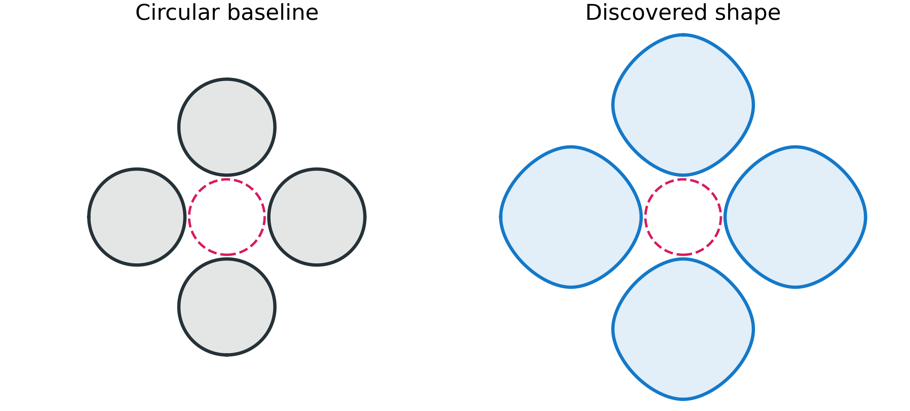
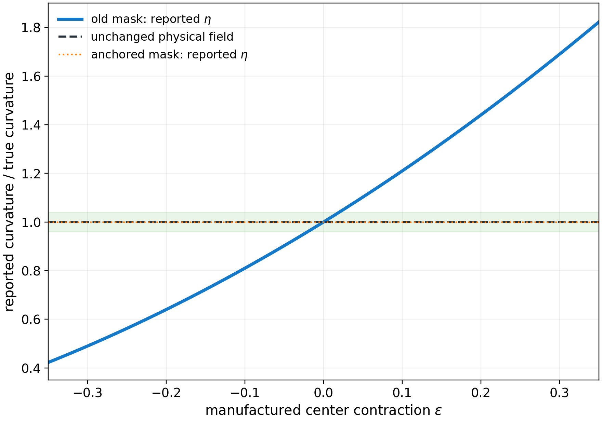
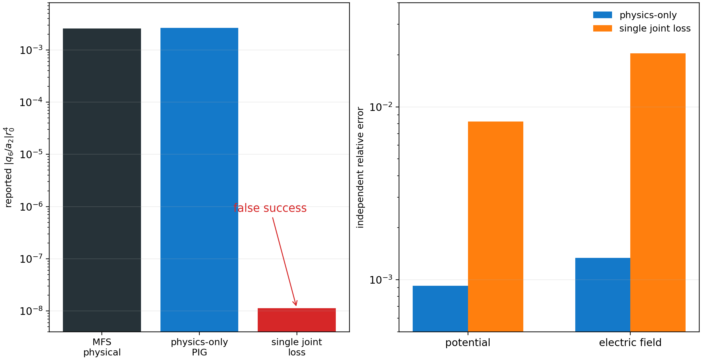
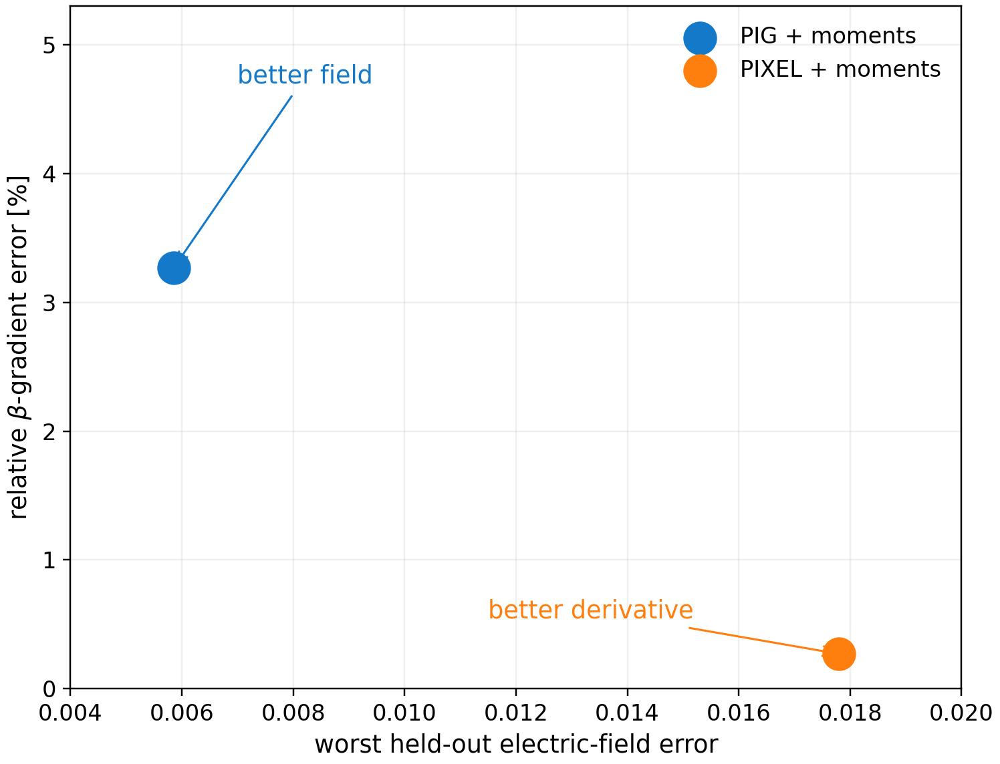
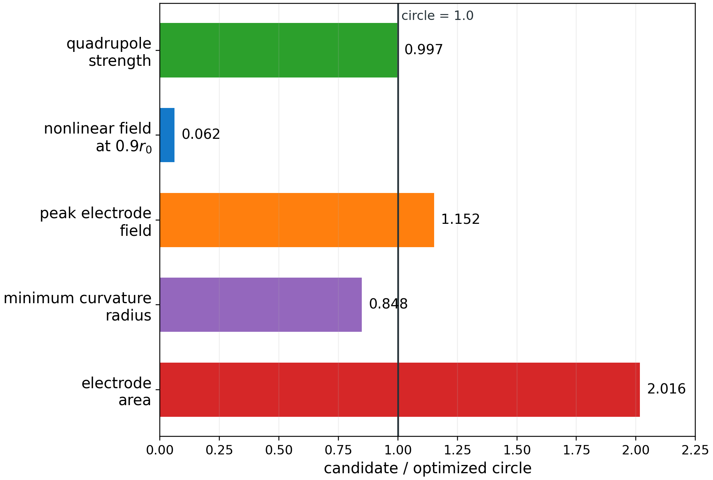

# When the Optimizer Improved the Wrong Thing: Shape Optimization for an Ion Trap

*George Liao · Google Summer of Code 2026 with [ML4SCI](https://ml4sci.org/activities/gsoc2026.html) · [SPINN project](https://ml4sci.org/gsoc/2026/proposal_SPINN1.html)*

*Mentors: Dale Julson, Eric Reinhardt, and Dinesh Ramakrishnan*

*A circular reference and the final two-parameter shape, drawn at the same trap scale. The dashed circle is where I compared their nonlinear electric fields.*

I spent this summer trying to make a physics-informed neural network redesign the electrodes of a Paul trap, where four pieces of metal set the transverse radio-frequency field used to trap charged particles. By the end, I had found a smooth electrode that reduced a normalized measure of field nonlinearity by a factor of 16.2 relative to an optimized circular reference, while retaining 99.7% of its useful central quadrupole field.

The less elegant part of the project was that the first end-to-end neural optimizer did not produce that electrode. It found several ways to improve its own score without improving the physics, so much of the project became an investigation of what a trustworthy shape gradient, field solver, and independent design check would actually require.

## Why the electrode shape matters

In a cross-section of the trap, four electrodes surround a charge-free central region, where the potential $V$ must satisfy Laplace's equation, $\nabla^2 V=0$. With the alternating voltages and fourfold geometry used here, the central solution can be written as a useful quadrupole plus progressively smaller nonlinear terms:

$$
V(r,\theta)=a_2r^2\cos(2\theta)+a_6r^6\cos(6\theta)+a_{10}r^{10}\cos(10\theta)+\cdots.
$$

The coefficient $a_2$ sets the useful quadrupole strength, while $a_6$, $a_{10}$, and later terms distort the field once an ion moves away from the exact center. One measure of the central strength is the dimensionless geometric efficiency $\eta=2a_2r_0^2/V_0$, with $r_0$ the trap scale and $V_0$ the voltage scale, but maximizing $\eta$ alone would not tell me whether the field remained close to a quadrupole over a finite region. I therefore tracked the nonlinear harmonics and the electric-field error separately.

Changing an electrode also changes the boundary of the PDE domain, which means that an ordinary numerical optimization has to rebuild or update its mesh and re-solve the field for every candidate shape. The [SPINN project proposal](https://ml4sci.org/gsoc/2026/proposal_SPINN1.html) suggested a way around that repeated geometry work: represent the field with a physics-informed neural network (PINN), and let a second network move coordinates so that gradients can flow from a design objective back to the metal.

## Building the differentiable system

I started with a fixed reference domain and a coordinate-projection network that mapped a reference point $z$ to a physical point $x=T_\phi(z)$. Its displacement was initialized to exactly zero, so training began with the known electrode geometry rather than a randomly distorted one, and a spatial mask was meant to concentrate motion near the electrode surfaces. For a learned potential $u(z)$, the physical gradient depends on the map's Jacobian $J=\partial T_\phi/\partial z$ through $\nabla_xV=J^{-T}\nabla_zu$; the Laplace residual must use this physical derivative, not simply differentiate $u$ twice in reference coordinates.

Because reference and physical derivatives are different, I checked the pullback operator against manufactured affine and radial maps, monitored $\det J$ to catch folding, and compared learned fields with analytic solutions and separate numerical references. Gmsh/DEVSIM and a finite-difference solver were useful checks for the earlier fixed-geometry experiments, although the fine curved-boundary and high-harmonic comparisons later needed a boundary-based method of fundamental solutions (MFS). All three neural field representations used the same sampling, loss, and evaluation interface, so changing a backend did not silently change the physical problem being tested.

The first backend was an ordinary multilayer perceptron (MLP), which gave me a baseline PINN and a place to debug the geometry machinery. A 19-setting early sweep made boundary enforcement more important than simply adding network capacity, while ReLU supplied an especially misleading result: because its second derivative vanishes almost everywhere, it could show a small Laplace residual without recovering the correct field.

I then tried two local representations. PIXEL stores learnable features on grids, interpolates them at each query point, and passes the resulting feature vector through a small decoder; Physics-Informed Gaussians (PIG) instead builds feature channels from weighted Gaussian functions whose centers and widths can move during training, then decodes those channels into a voltage. Both still need the PDE and electrode-voltage constraints, and automatic differentiation still has to supply the first and second spatial derivatives. The scientific question was whether local features could represent the field, its small harmonics, and its *shape derivative* accurately enough for design—not which model could win a single loss comparison.

## The shortcuts the optimizer found

The original deformation mask looked local around each rod, but its bands overlapped across the center, where I measured quadrupole curvature, and it was still active at the enclosure. To test whether that mattered, I held the electrodes and the physical field fixed while applying a smooth contraction of the measurement coordinates; the reported curvature changed as $(1+\epsilon)^2$, even though no physical field had changed.

*Because the original mask let a coordinate change masquerade as a better electrode, I pinned the entire measurement region to remove that particular shortcut.*

I replaced the mask with a smooth electrode collar that is exactly zero throughout the central measurement disc and at the outer enclosure. For the tested $0.15r_0$ inward rod motion, a $0.35r_0$ collar kept the map orientation-preserving, with minimum $\det J=0.400$ and maximum local condition number $2.50$. The same audit showed that uniform training points missed the most compressed parts of the collar, and that integrals pulled back to the reference domain needed the Jacobian determinant: adding it reduced a manufactured integration error from $0.0869$ to $5.3\times10^{-11}$.

Fixing the mask exposed a different omission because, once the central disc could no longer move, differentiating its objective through a *frozen* field gave zero even though moving a conductor should change the field at an anchored observation point. The physical design derivative includes the field's re-equilibration on the new geometry: in one controlled radius test, the re-solved PIG derivative was $-0.07356$, against $-0.06539$ from a separate MFS solve. Although the two derivatives did not agree perfectly, the comparison identified the response term that the frozen-field gradient had missed altogether.

I tested the field/design coupling more directly by fixing the electrodes and asking one joint loss to drive a nonzero harmonic toward zero. Since the metal could not move, a successful optimizer could only be changing its account of the field. The independent harmonic ratio was $2.584\times10^{-3}$, and a physics-only PIG returned $2.653\times10^{-3}$; the joint model reported $1.13\times10^{-8}$ while its independent potential and electric-field errors became roughly nine and fifteen times worse.

*Because no electrode moved in this test, the apparent design gain could only come from the learned field becoming less accurate.*

I also tested Coulomb-based scaling of the field and potential residuals; although the associated field, potential, and inverse-distance quantities then had the same units, their characteristic values spanned about 15.7 orders of magnitude, and the training losses and parameter gradients remained badly imbalanced. After 400 matched training steps, the equal-weight version had field error $0.086$ against $0.008$ for the ordinary dimensionless baseline. As for the older joint runs that appeared to improve geometric efficiency, the later audit marked their headline numbers as superseded: the score was vulnerable to coordinate motion, and the rasterized validation grid was too coarse to certify the small shape changes.

## Testing PIG and PIXEL

After the fixed-geometry checks, the backend experiments became more informative. For a symmetric fixed electrode, projecting PIG's final *output* onto the known fourfold voltage symmetry improved potential, electric-field, and small-harmonic errors in one matched test, while tying symmetry inside the Gaussian features was less reliable. The symmetry had to follow the electrodes, though: forcing fourfold symmetry onto an intentionally one-axis trap moved the predicted electrical null to the wrong place and produced 17.2% potential and 26.1% field error. PIG also needed an Adam-to-L-BFGS training stage before it consistently recovered the sign of the small higher harmonic.

PIXEL raised a different question because its original cosine interpolation is continuously differentiable once, whereas a Laplace residual depends on second derivatives. A quintic interpolation that is smooth through the second derivative improved potential, field, and boundary error in one matched short run, although that experiment alone does not establish a general advantage. I later conditioned both representations on a varying circular-electrode radius, $u(z,d)$, and supplied the raw harmonic coefficients as training targets, because a field model that is useful for optimization must describe how the field changes with the geometry parameter $d$, not just fit one completed shape.

*On the same tested geometry family, the better spatial field and the better local design derivative came from different backends.*

With that supervision, PIG had the better held-out spatial field, while PIXEL had the better derivative of the unwanted-harmonic ratio in this one-parameter comparison; neither was a universal winner. A separate geometry-conditioned PIG, using the correct parity for an asymmetric family, passed field, electrical-null, and shape-derivative checks on six unseen geometries and a second training seed, although it learned one smooth parameter rather than a free-form electrode. Those tests made the acceptance rule much clearer: potential, electric field, small multipoles, and total shape derivatives each need their own held-out check.

## Solving the field before moving the metal

For the final search, I used an MFS inner solve: logarithmic sources placed outside the vacuum region produce fields that already satisfy Laplace's equation inside it, and their weights are fitted to the electrode voltages for each proposed geometry. Only after that fixed-geometry field was solved did I measure the objective and move the boundary. I also checked the boundary derivative against complete neighboring-geometry solves; across three local tests, its relative error ranged from $2.09\times10^{-8}$ to $2.18\times10^{-6}$. Unlike a generic coordinate displacement, this derivative responds to physical motion normal to the metal surface, not to tangential relabeling of the same surface.

The shape search used two variables: overall electrode size $R$ and a fourfold deformation $c_4$ of a smooth convex boundary, described by the *support function* $p(\theta)=R[1+c_4\cos(4\theta)]$ (not by a polar radius). I chose those two variables because they could cancel the first two allowed nonlinear coefficients, $a_6$ and $a_{10}$, and the high-resolution numerical root was $R/r_0=1.630529854$, $c_4=0.026949792$.

At $0.9r_0$, the candidate's RMS departure from its own ideal quadrupole field, normalized by that quadrupole field, was $0.06184$ times the same measure for the optimized circle—a 16.2-fold reduction—while it retained $0.997006866$ of the circle's quadrupole strength. On boundary points withheld from the fit, the solved field had voltage RMSE $8.56\times10^{-7}$, while separate MFS re-solves with different exterior-source layouts returned nearly the same candidate. Those checks concern the two-dimensional mathematical model; they are not an independent FEM/BEM check or a three-dimensional device validation.

*The cleaner field came with a larger electrode and less favorable surface-field and curvature measures.*

The result is therefore a field-linearity candidate with engineering tradeoffs: relative to the circle, its peak electrode-surface field rose 15.2%, its minimum radius of curvature fell 15.2%, and its two-dimensional electrode area doubled. A later RF-trajectory check made the limits of a single field objective even clearer, because improved field linearity did not, by itself, establish better survival or mass-filter performance under every operating condition.

## What I would carry forward

For a single two-dimensional Laplace problem, a conventional boundary solve remains easier to trust than a newly trained PINN; the learned models become more interesting when they can reuse a field representation across many geometries. One later direction used an exactly harmonic central-field head that learns geometry-dependent coefficients rather than asking a network to rediscover Laplace's equation, while Green-function features offered a related way to make PIG harmonic by construction. Both need explicit geometry ranges and held-out derivative tests before they can replace the trusted inner solve.

Because the summer's strongest electrode was found in a narrow family, the next design problem needs more than a larger network: it needs fixed requirements for electrode gap, outer envelope, voltage, surface field, curvature, fabrication errors, and the actual trapping or filtering objective. Only then would a free-form or three-dimensional optimizer have a question precise enough to answer. I started with the hope that differentiable physics would make geometry optimization straightforward; I finished with a working modular research system, a verified two-dimensional candidate, and a much better understanding of the ways an optimizer can be right about its loss while wrong about the device.

Thanks to Dale Julson, Eric Reinhardt, and Dinesh Ramakrishnan for their guidance, and to the ML4SCI and GSoC communities for making the project possible.

**Code and experiment record:** [SPINN repository](https://github.com/ML4SCI/SPINN) · [project implementation](spinn/README.md) · [consolidated results and limitations](exp/harmonic_source_shape_search/RESULTS.md) · [two-parameter candidate validation](exp/harmonic_source_shape_search/07_dual_zero_candidate_validation.py) · [boundary-shape derivative test](exp/harmonic_source_shape_search/10_boundary_shape_derivative.py).
